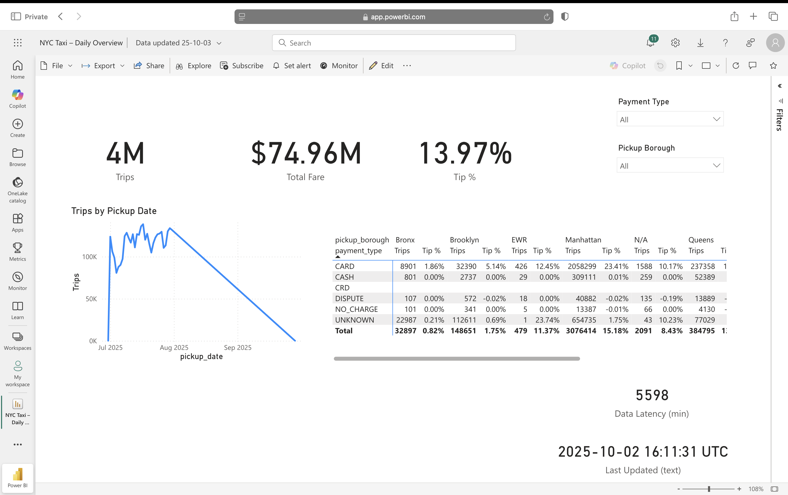

# Streaming + Batch ELT → Synapse DW (Hourly + Backfill)


## Business Problem
Processing 1M+ daily NYC taxi trips in near real-time while maintaining a single source of truth for business intelligence. Achieves <60 minute data freshness with automatic quality checks and failure recovery.

**Impact:** Enables data-driven decisions on fleet optimization, demand forecasting, and pricing strategies with hourly granularity.

**One‑liner:** Event Hubs & ASA land **raw/curated/DLQ** to ADLS; ADF loads Synapse **hourly** (with backfill). Batch ELT shares the **same model**. Power BI shows **Last Updated / Latency** so freshness is clear.

**Why it matters:** Reliable, idempotent warehouse loads with DLQ, alerts, and range backfills. A single source of truth powers BI from both streaming and batch.

---

## Architecture (high level)


```
                 ┌────────────────────────────── Streaming Lane ──────────────────────────────┐
Producer(s) → Event Hubs → Stream Analytics (parse + DQ) → ADLS Gen2
                                     ├─ Raw JSONL  → streaming/…/date=YYYY/MM/DD/time=HH/…
                                     ├─ Curated CSV → streaming-curated/…/date=…/time=…/…
                                     └─ DLQ JSON    → streaming-dlq/…/date=…/time=…/…
                                     |
                                     └→ ADF hour pipeline → Synapse (stg → slice → dims → fact)
                                              └→ Backfill wrapper (lastHour | fixedHour | range)

                 └────────────────────────────── Batch ELT Lane ───────────────────────────────┘
Batch files (landing) → ADF (copy/transform) → Synapse (stg → core → mdl.* same model tables)

Power BI → reads from Synapse view (shared by batch & streaming)


## Lambda Architecture Implementation

### Batch Layer (Cold Path)
- **Frequency**: Daily full refresh + hourly incremental
- **Latency**: 2-3 hours
- **Use Case**: Historical analysis, reconciliation, reprocessing
- **Tech Stack**: ADF → Synapse → Power BI

### Speed Layer (Hot Path)  
- **Frequency**: Continuous
- **Latency**: <60 minutes
- **Use Case**: Near real-time dashboards, alerts
- **Tech Stack**: Event Hubs → ASA → ADLS → ADF → Synapse

### Serving Layer
- **Unified Model**: `mdl.fact_trip` + dimensions
- **Access Pattern**: Power BI DirectQuery + Import mode
- **SLA**: 99.9% availability

```

**Core ideas**
- **Separate concerns**: stream continuously to the lake; micro‑batch the warehouse (hourly) for reliability & cost.
- **Synapse‑safe upsert**: update‑then‑insert (no reliance on `@@ROWCOUNT`/`MERGE OUTPUT`). 
- **Run‑scoped purge**: delete `core.trip_clean_slice` by `_runId` after each model load (clean reruns/backfills).
- **Shared model**: both lanes feed `mdl.fact_trip` & dims → BI stays unchanged.

---
## Technologies Demonstrated

| Category | Technologies | Key Patterns |
|----------|-------------|--------------|
| **Streaming** | Event Hubs, Azure Stream Analytics | Event sourcing, windowing, watermarking |
| **Storage** | ADLS Gen2 (Delta Lake ready) | Medallion architecture, partitioning |
| **Compute** | Synapse Dedicated SQL Pool | MPP, distributions, columnstore |
| **Orchestration** | Azure Data Factory | Metadata-driven, idempotent pipelines |
| **IaC** | Terraform (batch), Bicep (streaming) | GitOps, environment promotion |
| **CI/CD** | GitHub Actions | Plan/apply gates, branch protection |
| **Monitoring** | Log Analytics, Azure Monitor | Proactive alerting, SLA tracking |
| **Governance** | Microsoft Purview | Data lineage, cataloging |
| **Security** | Managed Identity, RBAC, TruffleHog | Zero secrets, least privilege |
| **BI** | Power BI | Real-time dashboards, KPIs |

---

## What’s included

- **Streaming**
  - ASA wiring: parse/enrich; three sinks (raw/curated/DLQ) with hourly partitioning.
  - ADF hour pipeline: Copy curated → staging; build slice; upsert dims & fact; purge slice; log.
  - Backfill: wrapper supports **lastHour / fixedHour / range** (hour‑by‑hour loop).
- **Batch ELT**
  - Existing pipelines to load the same **mdl** model (fact + dims), aligned keys.
- **Model**
  - `mdl.fact_trip`: `CHAR(64)` SHA‑256 `trip_id`, **DISTRIBUTION = HASH(trip_id)**, **CLUSTERED COLUMNSTORE**.
  - Dims: vendor, payment, location (replicate). Rate/flag optional.
  - BI view: `mdl.vw_fact_trip_bi` (flattened with freshness fields).
- **BI**
  - Power BI report with **Trips**, **Total Fare**, **Tip %**, **Last Updated (UTC)** & **Latency (min)** cards.
- **Ops**
  - Hourly trigger; Azure Monitor alerts (ADF/ASA/EH/SQL); ADLS lifecycle rules; RBAC via MSI where possible.

---

## Key design choices (short)

- **Idempotent upsert**: stage → **UPDATE** matched diffs → **INSERT** new → counts via temp tables; expose counts via a 1‑row `SELECT` or log inside SP.
- **Distribution strategy**: big fact **HASH(trip_id)** + CCI; small dims **REPLICATE** → avoids runtime **shuffles**.
- **Backfill simplicity**: wrapper with an **Until** loop: process hour → bump hour → repeat.
- **Quality**: curated = rows that pass DQ; DLQ = rejects with reason; raw = full fidelity.

---

## Quality & lineage (optional roadmap)

- **Row‑level data quality counters** *(M)*  
  Count per run: `good_rows`, `dlq_rows`, `negative_fare`, `bad_duration`, `null_vendor`, etc. Log in audit or a dedicated table.
- **Purview lineage** *(L)*  
  Register EH, ASA, ADLS, ADF, Synapse. Expected lineage: **EH → ASA → ADLS → ADF → Synapse**.

---

## Operating the solution (at a glance)

- **Hourly**: trigger runs the hour pipeline for the **last completed hour**.
- **Backfill**: set `startHourUtc`/`endHourUtc` (ISO hour). Wrapper loops hours and calls the hour pipeline each iteration.
- **Reruns**: safe; run‑scoped purge ensures clean idempotent loads.
- **Alerts** (Azure Monitor): 
  - ADF: Pipeline/Activity failed runs.
  - ASA: Watermark delay/backlog, job status.
  - Event Hubs: Throttled requests, server errors.
  - Synapse: CPU/tempdb/queue depth.
  - Storage (optional): availability/5xx.
- **Lifecycle**: curated → Cool @7d, delete @30–60d; DLQ longer; staging cleanup @7d.

---

## Verification quick checks

- Slice purged: `SELECT COUNT(*) FROM core.trip_clean_slice WHERE _runId='<RunId>';` → **0**.
- Fact touched recently: `SELECT TOP 5 trip_id, last_upsert_at FROM mdl.fact_trip ORDER BY last_upsert_at DESC;`.
- Power BI freshness: **Last Updated** card matches last successful hour; **Latency (min)** sane.

---

## Repository Structure
```text
.
├── infra/
│   ├── terraform/          # Batch infrastructure (ADF, Synapse, Purview)
│   ├── streaming-bicep/    # Streaming infrastructure (EH, ASA)
│   └── scripts/           # Wire-up and diagnostic scripts
├── orchestration/
│   ├── adf/              # ADF pipelines, datasets, linked services
│   └── synapse/          # Notebooks for advanced transformations
├── sql/
│   ├── batchELT/         # Batch SQL objects
│   │   ├── staging/      # STG schema tables
│   │   ├── core/         # CORE transformations
│   │   ├── mdl/          # Model layer (facts/dims)
│   │   └── ops/          # Operational tables
│   └── streaming/        # Streaming SQL objects
├── docs/
│   ├── img/              # Architecture diagrams, screenshots
│   ├── README_modeling.md
│   └── README_transform.md
├── tools/
│   └── streaming/
│       └── producer/     # Python event producer
├── tests/                # Data quality tests
└── .github/
    └── workflows/        # CI/CD pipelines


``` 

---

## Security Practices

This repository has been scanned for security vulnerabilities and secrets:
- **Secret Scanning**: Verified using [TruffleHog](https://github.com/trufflesecurity/trufflehog) - no secrets detected
- **Managed Identities**: All Azure authentication uses system-assigned managed identities
- **RBAC**: Least privilege access implemented across all resources
- **Environment Variables**: Sensitive configuration stored in GitHub Environment Secrets (not in code)
```bash
# Security scan performed with:
trufflehog --regex --entropy=False https://github.com/neelamsk/azure-nyctaxi-lambda-elt
```  

---


## What You'll Learn

This project demonstrates enterprise patterns for:
- Building resilient streaming pipelines with proper error handling
- Implementing medallion architecture (Bronze/Silver/Gold)
- Handling late-arriving data and exactly-once semantics
- Optimizing Synapse distributions to avoid data shuffling
- Creating idempotent pipelines safe for reruns
- Implementing comprehensive monitoring and alerting
- Managing infrastructure as code with proper state management

---

### Common Issues & Solutions

| Issue | Check | Solution |
|-------|-------|----------|
| Pipeline stuck | `ops.run_log` status | Check for blocking queries in Synapse |
| DQ failures high | `ops.dq_result` details | Review source data quality, adjust thresholds |
| Slow performance | Synapse query stats | Update statistics, check distributions |
| Missing lineage | Purview scan status | Ensure scans run after pipeline completion |
| Storage costs high | Lifecycle policies | Move to Cool tier after 30 days |

---

## Docs

- **Batch ELT (detailed):** `README_BATCHELT.md`  
- **Streaming (detailed):** `README_STREAMING.md`

---

## Result (screenshot)


---

## License
MIT (or your preferred license).
