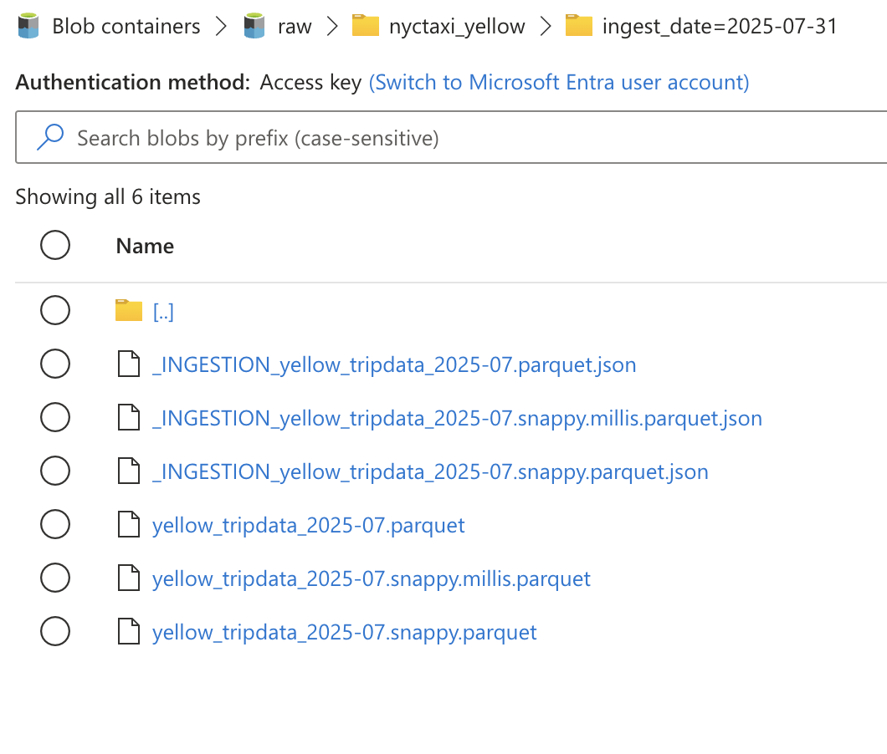

# Batch ELT on Azure (Dev) — Source & Landing → Staging

> **TL;DR**: This project implements an **ADF-only batch ELT** that lands Parquet files into **ADLS Gen2 (raw)** with a **per-file manifest**, and loads them **idempotently** into **Synapse Dedicated SQL Pool (staging)** with **audit columns**, **DQ gates**, **run logging**, **daily scheduling**, and **observability** via Log Analytics. Optional governance via **Microsoft Purview** shows lineage (file → ADF → staging table).

---

## 📌 Architecture (Dev)

  
*Placeholder: simple diagram showing ADLS (raw), ADF pipeline, Synapse (staging), Log Analytics, and optional Purview.*


---
## 📊 Batch ELT Process — Overview

1. **Source & Landing (Data Ingestion)** — Raw files → ADLS Gen2 (`raw/`)  
   *Immutable history, backfill, lineage*

2. **Staging (Raw → Staging tables)** — Parquet → Synapse `stg` schema  
   *Idempotent, auditable loads*

3. **Transformation (Staging → Core)** — Clean types, filter junk, dedupe  
   *Stable, business-ready building blocks*

4. **Modeling (Core → Star schema)** — Facts/dimensions for BI  
   *Fast queries, consistent metrics*

5. **Data Quality & Validation** — Row counts, nulls, FK coverage  
   *Green check after each load*

6. **Orchestration** — Daily schedule + backfill via ADF  
   *Reliable, repeatable runs*

7. **Governance (Catalog & Lineage)** — Purview scans + data dictionary  
   *Compliance, discoverability, trust*

8. **Security & Secrets** — RBAC + Managed Identity + (later) Key Vault  
   *Least privilege, no secrets in code*

9. **Monitoring & Cost** — Log Analytics alerts + pause/resume DW  
   *Reliability, $$$ control*

10. **BI & Consumption** — Power BI over Synapse  
    *Closing the loop for end-users*

---

## 📂 Repository layout

```
infra/terraform/           # Azure resources (ADLS, ADF, Synapse, Purview, RBAC)
ingest/                    # Dev landing utilities (upload/backfill scripts)
  upload_raw.sh
  backfill_dates.sh
sql/                       # DDL/DML (staging schema, run log, DQ results)
adf/                       # (optional) ADF factory JSON if checked-in
docs/
  README.md                # ← this file
  img/                     # screenshots/diagrams for proof
```

---

## 🔧 Environments & naming

- **Environment**: dev  
- **Storage account**: `eltazr3adls`  
- **Containers**: `raw`, `synapse`  
- **Dataset (example)**: `nyctaxi_yellow`  
- **Raw path convention**: `raw/<dataset>/ingest_date=YYYY-MM-DD/<file>.parquet`  
- **Manifest per file**: `_INGESTION_<file>.json` in the same folder  
- **Synapse DB**: dedicated SQL pool (staging schema: `stg`)

---

## ✅ Prerequisites

- Infra provisioned (Terraform applied).
- ADF managed identity = **Storage Blob Data Contributor** on the storage account.
- Your user has temporary Blob Data Contributor (for dev landing) or uses OIDC in CI.
- Synapse login created for ADF MI with **db_datareader/db_datawriter** (least privilege).
- (Optional) Purview account in dev.

---

## 1) Source & Landing (raw)

**Goal:** land files exactly as received (no transforms) into `raw/<dataset>/ingest_date=YYYY-MM-DD/`, and write a **per-file manifest** capturing checksum and metadata. **Never overwrite** raw files (append-only).

### 1.1 Dev landing script

- Script: `ingest/upload_raw.sh`  
- Behavior:  
  - Uploads to the date-partitioned path  
  - **No overwrite** (skips if exists)  
  - Computes **MD5**  
  - Writes `_INGESTION_<file>.json` (dataset, ingest_date, file, bytes, md5, source, run_id, run_by, status, ts_utc)

**Usage (example):**
```bash
bash ./ingest/upload_raw.sh nyctaxi_yellow ./data/yellow_tripdata_2025-07.parquet 2025-07-31
```

**Proof**  
  

---

## 2) Staging (raw → Synapse)

**Goal:** load raw files 1:1 into **staging** with audit columns: `ingest_date`, `source_file_name`, `loaded_at`. Keep it **idempotent** per day.

### 2.1 ADF assets (in ADF, not Synapse)

- **Linked services (examples):**
  - ADLS Gen2 (MI): `ls_adls_raw_adf`
  - Synapse SQL (dedicated pool): `ls_syn_sql_adf`
- **Datasets:**
  - `ds_raw_folder_adf` (Binary, ADLS)  
    - Params: `p_dataset`, `p_run_date`  
    - Directory: `@concat(dataset().p_dataset,'/ingest_date=',dataset().p_run_date)`
  - `ds_raw_parquet_adf` (Parquet, ADLS)  
    - Params: `p_dataset`, `p_run_date`, `p_file_name`  
    - Dir: as above; File: `@dataset().p_file_name`
  - `ds_syn_stg_trip` (Synapse table) → `stg.trip`

### 2.2 Pipeline: `pl_raw_to_stg_nyctaxi`

**Parameters**:  
- `dataset` (e.g., `nyctaxi_yellow`)  
- `run_date` (`YYYY-MM-DD`)  
- (optional) `run_id` (defaults to ADF pipeline RunId)

**Flow** (high-level):
1. **Start log** (Script) → insert `STARTED` into `ops.run_log`
2. **DeleteStagingPartition** (Script) → `DELETE FROM stg.trip WHERE ingest_date=@run_date`
3. **Get Metadata** (on `ds_raw_folder_adf`) → `childItems`
4. **Filter** → files only with desired suffix (e.g., `.snappy.millis.parquet`)
5. **ForEach** file:
   - **CopyToStaging** (Parquet → Synapse)
     - Source dataset: `ds_raw_parquet_adf` with `p_file_name=@item().name`
     - Sink dataset: `ds_syn_stg_trip`
     - Additional columns:
       - `ingest_date=@{pipeline().parameters.run_date}`
       - `source_file_name=@{item().name}`
       - `loaded_at=@{utcnow()}`
6. **DQ gates** (Scripts):
   - Rowcount > 0 → **fail** if 0  
   - No null pickup timestamp → **fail**  
   - Negative fare → **warning** (logged), cleaned in core
7. **Success log** (Script) → update `ops.run_log` to `SUCCEEDED` with `rows_copied`
8. **Failure log** (Script on failure path) → update `ops.run_log` to `FAILED`

**Idempotency**: pre-delete by `ingest_date` + per-file copy by name + no-overwrite in raw.

**Proof**  
  


---

## 3) Scheduling & backfill

- **Trigger**: Tumbling Window (1 day, UTC), **Max concurrency = 1**  
  `dataset = nyctaxi_yellow`  
  `run_date = @formatDateTime(trigger().startTime,'yyyy-MM-dd')`
- **Backfill**: Monitor → Triggers → Rerun → pick date windows.

**Proof**  


---

## 4) Data Quality & Run logging

- **Run log** table: `ops.run_log` (one row per run/date; status, rows, timestamps, message)  
- **DQ results** table: `ops.dq_result` (per check per run/date; PASSED/FAILED/WARNING)

**Verification queries** (examples):
```sql
-- Staging rowcount by date
SELECT ingest_date, COUNT(*) AS rows_loaded
FROM stg.trip
GROUP BY ingest_date
ORDER BY ingest_date;

-- Recent runs
SELECT TOP 20 status, rows_copied, started_at_utc, finished_at_utc
FROM ops.run_log ORDER BY started_at_utc DESC;

-- Recent DQ outcomes
SELECT TOP 20 check_name, status, actual_value, ingest_date, created_at_utc
FROM ops.dq_result ORDER BY created_at_utc DESC;
```

**Proof**  
  
  


---

## 5) Observability (Log Analytics & Alerts)

- **Diagnostic settings → Log Analytics**:
  - **ADF**: PipelineRuns, ActivityRuns, TriggerRuns
  - **Storage (Blob)**: Read/Write/Delete (for auth failures, etc.)
  - **Synapse workspace**: SQLRequests / Security (optional)
- **Alert**: “Any failed ADF pipeline run” (Metric or KQL)

**KQL samples** (in Log Analytics):
```kusto
-- ADF failed runs last 24h
ADFPipelineRun
| where Status == "Failed" and TimeGenerated > ago(24h)
| project TimeGenerated, PipelineName, RunId, Message

-- Storage auth failures last 24h
StorageBlobLogs
| where TimeGenerated > ago(24h)
| where StatusText startswith "AuthorizationFailure" or StatusText == "403"
| project TimeGenerated, OperationName, Uri, StatusText

-- ADF activity failures (not just pipeline failures)
ADFActivityRun
| where TimeGenerated > ago(24h)
| where Status == "Failed"
| project TimeGenerated, PipelineName, ActivityName, ActivityType, Error, RunId

-- Daily trend of pipeline outcomes (last 14 days)
ADFPipelineRun
| where TimeGenerated > ago(14d)
| summarize runs=count(), failures=countif(Status == "Failed"), successes=countif(Status == "Succeeded") by bin(TimeGenerated, 1d)
| order by TimeGenerated asc
```

**Proof**  


---

## 6) Governance (optional but recommended in corp)

- **Purview**: register ADLS + Synapse (SQL), run custom ruleset scans (Managed Identity), and verify **lineage**.
- **Lineage** should show: **raw file → ADF Copy → stg.trip**.

**Proof**  


---

## 7) Security posture (dev)

- **Managed Identity** everywhere; no connection strings or keys in code.
- Storage account: only **ADF MI** (and ingestion principal) have **write** to `raw/`; others read.
- Synapse DB: ADF MI = **db_datareader/db_datawriter** (not db_owner).
- **WORM** off in dev; Blob **versioning & delete retention** recommended and configured via Terraform.

**Proof**  


---

## 8) Operations runbook

**Re-run a day**  
- ADF → Monitor → Pipelines → `pl_raw_to_stg_nyctaxi` → **Trigger now**  
  - `dataset = nyctaxi_yellow`  
  - `run_date = YYYY-MM-DD`

**Backfill a range**  
- Monitor → **Triggers** → select Tumbling trigger → **Rerun** → date range.

**Where to look when red**  
1) ADF Monitor → open failing **Activity** → **Output/Error**.  
2) Check **ops.run_log** and **ops.dq_result** for the run.  
3) Log Analytics (Storage 403/Throttling, ADF failures).  
4) Verify raw path & filenames (case-sensitive).

---

## 9) Decision log (why this design)

- **ADF-only** orchestrator to keep assets in one place (no cross-product references).
- **Raw is immutable**: no overwrite; manifests for audit; replays/backfills are safe.
- **Idempotent staging**: pre-delete by date + per-file copy; repeatable loads.
- **DQ split**: staging checks catch structural issues; business filters (e.g., negative fares) are handled in **core**.
- **Observability**: Log Analytics + alerts to avoid manual log scraping.
- **Governance**: optional in dev; typical corp setup uses Purview scans and lineage.

---

## 10) Roadmap (next phase — Transformation → Core)

- Build `core.trip_clean` (CTAS/INSERT-SELECT from `stg.trip`):
  - Normalize types, filter junk (e.g., `fare_amount >= 0`), basic dedupe.
  - **CCI**; start with **ROUND_ROBIN**; consider HASH later.
- Add a couple more DQ checks in core (parity, keys).
- (Optional) Model star schema for BI.

---

## 📎 Appendix — Screenshots to add

- `docs/img/arch-dev.png` — Architecture diagram  
- `docs/img/adls-raw-listing.png` — Raw folder with manifest  
- `docs/img/adf-monitor-success.png` — ADF run (Monitor) showing success  
- `docs/img/adf-copy-rowscopied.png` — Copy activity details (rowsCopied, throughput)
- `docs/img/adf-trigger-tumbling.png` — Tumbling trigger config  
- `docs/img/sql-stg-rowcount.png` — Staging rowcount result  
- `docs/img/sql-run-log.png` — ops.run_log sample rows  
- `docs/img/sql-dq-results.png` — ops.dq_result sample rows  
- `docs/img/law-adf-failed-runs.png` — KQL in Log Analytics: failed pipeline runs 
- `docs/img/law-adf-activity-failures.png` — KQL in Log Analytics: failed activities
- `docs/img/law-adf-copy-rowscopied.png` — KQL in Log Analytics: rowsCopied metrics
- `docs/img/law-adf-daily-trend.png` — KQL in Log Analytics: daily trend of runs
- `docs/img/law-storage-blob-ops.png` — KQL in Log Analytics: storage blob operations
- `docs/img/storage-rbac-adf-mi.png` — Storage RBAC showing ADF MI  
- `docs/img/purview-lineage-stg.png` — Purview lineage graph
- `docs/img/purview-scans.png` — Purview scans dashboard
