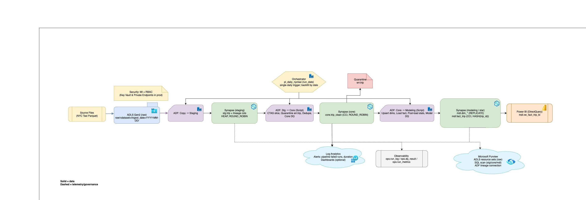
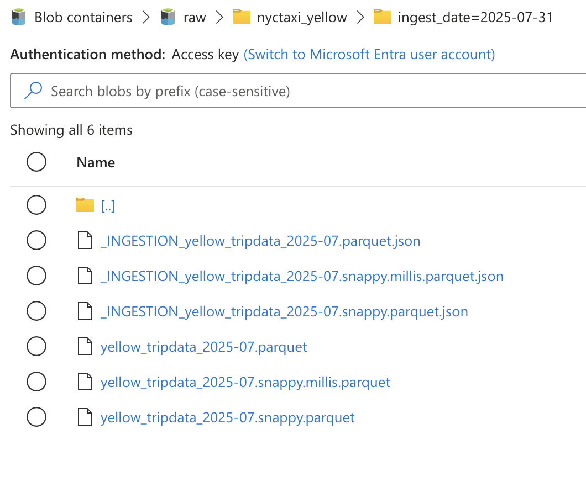
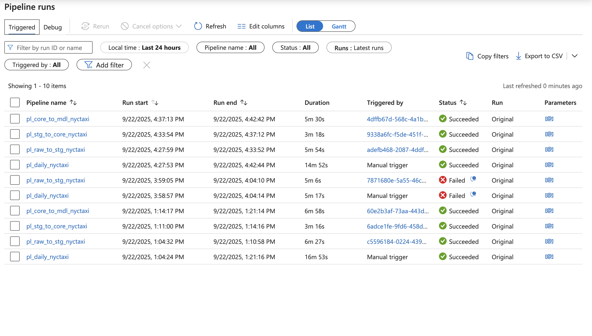
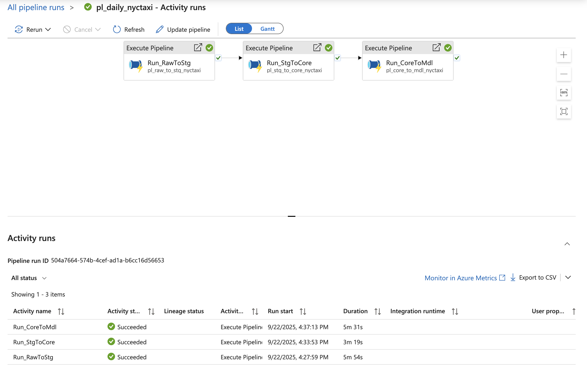
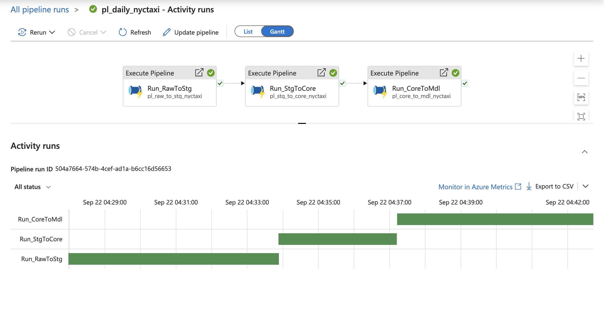
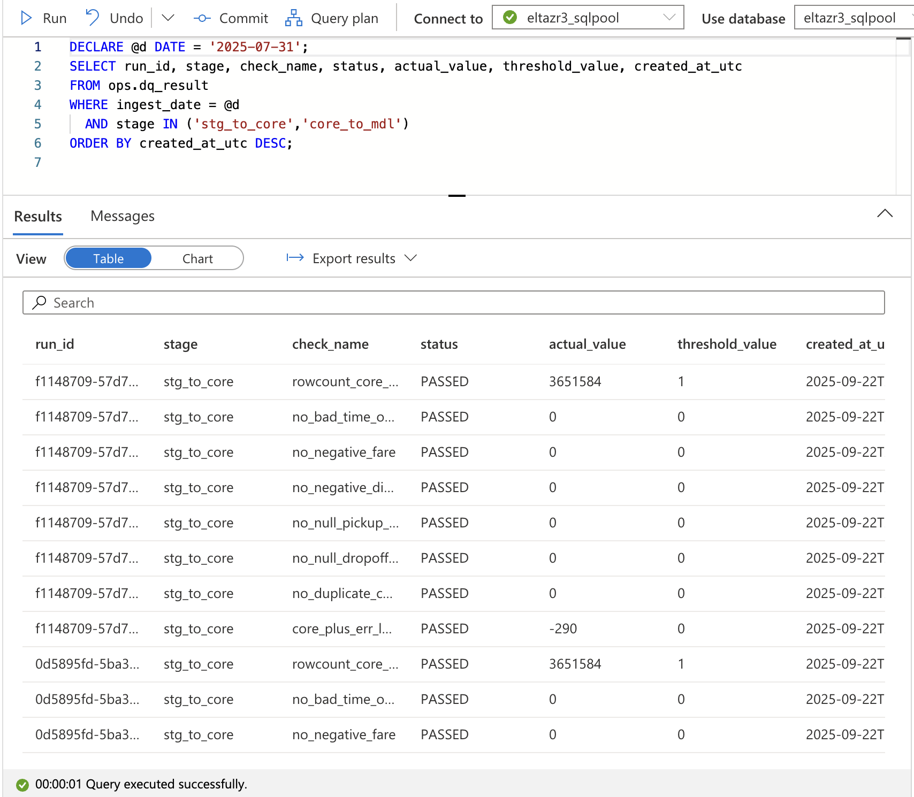
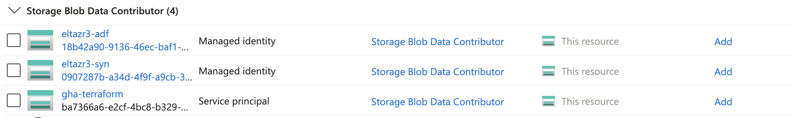
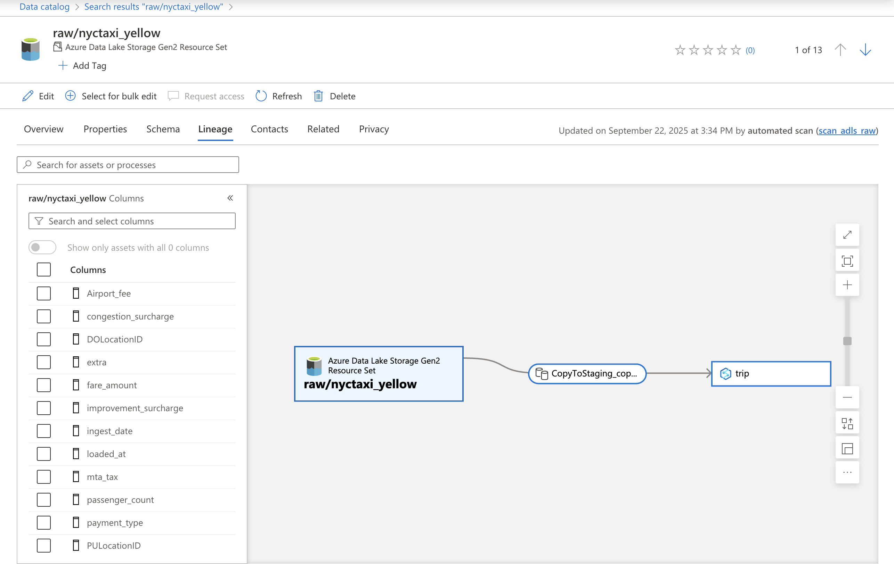
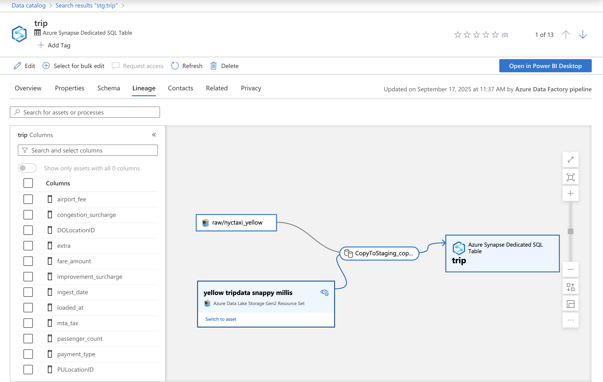
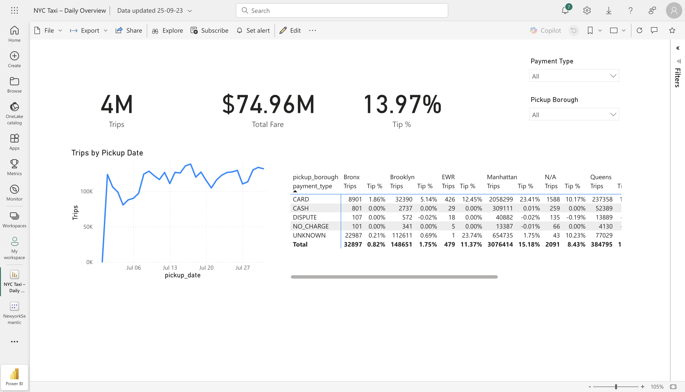

# Batch ELT on Azure (Dev) — Raw → Staging → Core → Modeling

> **TL;DR**: This project implements an **ADF-first batch ELT** that lands Parquet to **ADLS Gen2 (raw)**, loads **idempotently** to **Synapse (staging)**, transforms to **Core**, and then builds a **Modeling (Star) layer** with DQ gates, run logging, observability, and a single **orchestrator** pipeline. Optional governance via **Microsoft Purview** shows lineage *(raw → stg → core → mdl)*.




---

## 1) Source & Landing (raw)

- Land source files **as-is** to `adls/raw/<dataset>/ingest_date=YYYY-MM-DD/`.
- Keep raw immutable for backfills/replay and full lineage.




---

## 2) Staging

- Pipeline: **`pl_raw_to_stg_nyctaxi`**
- Copies landed files to **`stg.trip`** with minimal typing + lineage columns (`ingest_date`, `source_file_name`, `loaded_at`).
- Light DQ + run logging to **`ops.run_log` / `ops.dq_result`**.

---

## 3) Transformation (staging → core)

- Pipeline: **`pl_stg_to_core_nyctaxi`** *(called by the orchestrator)*
- CTAS slice → quarantine rejects → dedupe load to `core.trip_clean` → DQ gate → metrics + logging.
- Physical: `core.trip_clean` **ROUND_ROBIN + CCI**.

**Docs:** `sql/docs/README_transform.md` • **Dictionary:** `sql/docs/data_dictionary.md`

---

## 4) Modeling (core → star)

- Pipeline: **`pl_core_to_mdl_nyctaxi`** *(called by the orchestrator)*
- Upsert dims (vendor, payment, rate, flag, location) → load `mdl.fact_trip` (hash `trip_id`) → **post-load stats** → **Model DQ** → logging.
- **BI view:** `mdl.vw_fact_trip_bi` for friendly slicing (PU/DO role-play, measures).

**Docs:** `sql/docs/README_modeling.md`


---

## 5) Orchestration & Backfill

- Orchestrator: **`pl_daily_nyctaxi`** runs **raw → stg → core → mdl** with the **same** `run_date`.
- Single daily trigger (only on orchestrator). Backfill by calling the orchestrator with date lists.





---

## 6) Observability & Alerts


**Tables:** `ops.run_log`, `ops.run_metrics`, `ops.dq_result` (staging, core, modeling stages).  
**Alerts (Azure Monitor):**  
- **Pipeline failed runs > 0** on `pl_daily_nyctaxi` (primary alert)  
- *(Optional)* Activity failed runs > 0, Pipeline duration > N minutes

**Future (optional):**  
- Log Analytics workbook: pipeline run trend, DQ pass/fail trend, rows_loaded by date.  
- Add **cost view** (SQL DW pause/resume windows; data processed).



---

## 7) Security posture (dev) & prod hardening

**Today (dev):**
- **AuthN:** Managed Identity on ADF/Synapse; no secrets in code.
- **AuthZ:** RBAC to Storage & SQL (least privilege).
- **Purview access:** Purview MI has Storage Blob Data Reader + DB `db_datareader` / `VIEW DEFINITION`.
- **Data:** NYC Taxi sample has no direct PII; only financial fields (fare/tip/tolls).

**Prod hardening plan:**
- **Secrets:** if any credentials remain, move to **Key Vault**; use MI wherever possible.
- **Networking:** private endpoints for ADLS, Synapse SQL, and Key Vault; restrict public network access and enable firewall rules/NSGs.
- **Policies:** enable Defender for Cloud recommendations; enforce “no public access” and “https only” policies; tag resources (env, owner, cost-center).
- **RBAC hygiene:** least privilege roles; break-glass procedure documented.
- **Purview governance:** glossary terms for conformed dims; (if PII exists later) apply classifications and masking policies.




---

## 8) Governance (Purview)

- **ADLS scan** on `raw/` with a **Pattern rule** to group `ingest_date=` partitions as a **resource set**.  
- **SQL scan** on the **Dedicated SQL database** to catalog `stg/core/mdl` tables.  
- **ADF ↔ Purview** connection to emit lineage **process nodes**.
- **Scheduling order:** Orchestrator run → **ADLS** scan → **SQL** scan (keeps assets + lineage current).

**Expected lineage:**  
`raw file → (ADF Copy) → stg.trip → (Script) → core.trip_clean → (Script) → mdl.fact_trip`





---

## 9) Repository Structure
```text
.
├── infra/
│   ├── terraform/          # Batch infrastructure (ADF, Synapse, Purview)
│   ├── streaming-bicep/    # Streaming infrastructure (EH, ASA)
│   └── scripts/           # Wire-up and diagnostic scripts
├── orchestration/
│   ├── adf/              # ADF pipelines, datasets, linked services
│   └── synapse/          # Notebooks for advanced transformations
├── sql/
│   ├── batchELT/         # Batch SQL objects
│   │   ├── staging/      # STG schema tables
│   │   ├── core/         # CORE transformations
│   │   ├── mdl/          # Model layer (facts/dims)
│   │   └── ops/          # Operational tables
│   └── streaming/        # Streaming SQL objects
├── docs/
│   ├── img/              # Architecture diagrams, screenshots
│   ├── README_modeling.md
│   └── README_transform.md
├── tools/
│   └── streaming/
│       └── producer/     # Python event producer
├── tests/                # Data quality tests
└── .github/
    └── workflows/        # CI/CD pipelines

---

## 10) Operations runbook

**Re-run a day (end-to-end)**  
- ADF → Monitor → Pipelines → **`pl_daily_nyctaxi`** → *Trigger now*  
  - `dataset = nyctaxi_yellow`  
  - `run_date = YYYY-MM-DD`

**Where to look when red**  
- `SELECT TOP 50 * FROM ops.run_log ORDER BY started_at_utc DESC;`  
- `SELECT TOP 50 * FROM ops.dq_result ORDER BY created_at_utc DESC;`  
- `SELECT TOP 50 * FROM ops.run_metrics ORDER BY run_ts_utc DESC;`

---

## 11) BI & Consumption

- Power BI model on `mdl.vw_fact_trip_bi` (DirectQuery)  
- Consistent KPI measures (Tip %, Avg Fare/km, Night Ride %)  
- Semantic model + row-level security (if needed)  
- Performance tuning at scale (partitioning, CTAS load patterns)  
- Cost hygiene: auto-pause/resume SQL pool; Log Analytics dashboards


---

## 12) Performance & Optimization

### Optimizations Applied
- **CTAS for rebuilds** instead of DELETE/INSERT
- **Clustered Columnstore** for analytical queries
- **Statistics updates** post-load for query optimizer
- **Partition switching** for large historical loads (future)

---

## 13 Screenshots to include (portfolio-ready)

Place images in `docs/img/` and reference them from this README.

- **Orchestrator run (green)** with child pipelines expanded — `docs/img/orchestrator_success.png`
- **Activity timeline** showing `CoreDQ_Gate` and `ModelDQ_Gate` — `docs/img/dq_gates_timeline.png`
- **DQ results** query (`ops.dq_result` filtered by a date, stage=`core_to_mdl`) — `docs/img/dq_results_sql.png`
- **Run log** query (`ops.run_log` last runs) — `docs/img/run_log_sql.png`
- **Purview lineage** for `mdl.fact_trip` (show process nodes) — `docs/img/purview_lineage_fact_trip.png`
- **Raw resource set** (grouped `ingest_date=` partitions) — `docs/img/purview_raw_resource_set.png`
- **BI visual** (Trips by date; matrix by payment type × borough) — `docs/img/pbi_overview.png`

---

## Related docs
- **High-level README**: `README.md`
- **Streaming ELT**: `README_STREAMING.md`

---

## License
MIT (or your preferred license).
