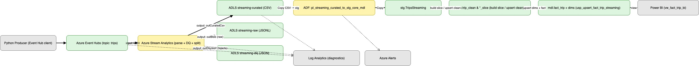
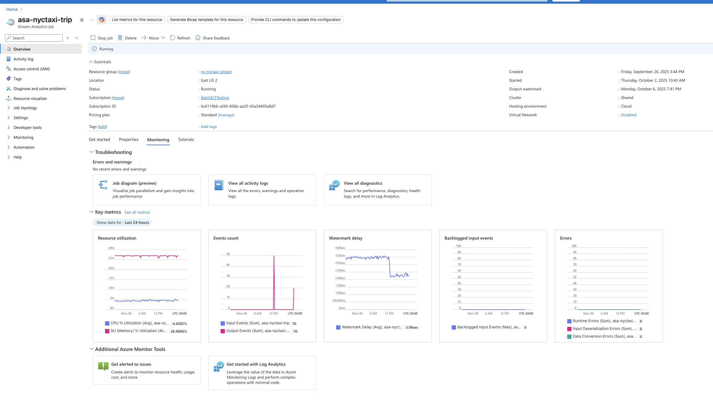
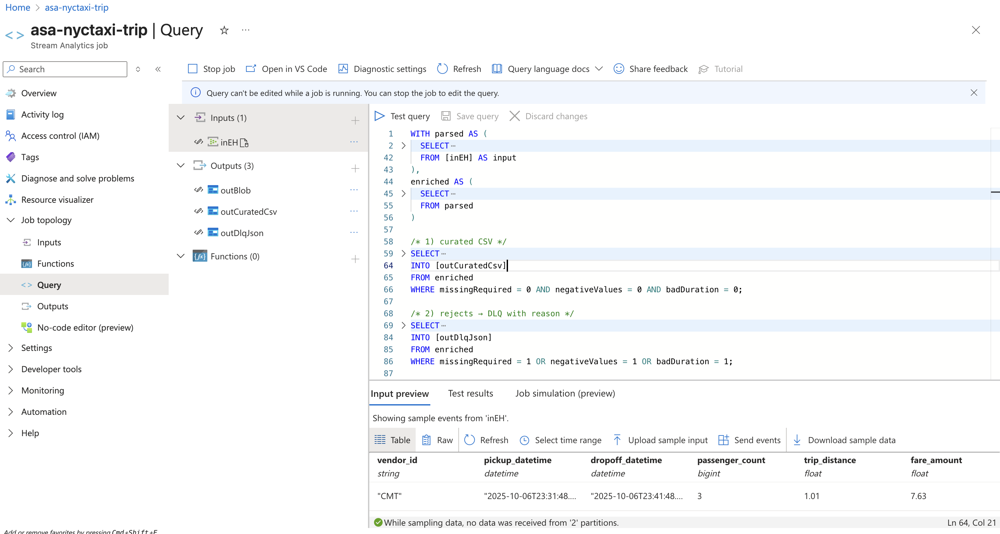
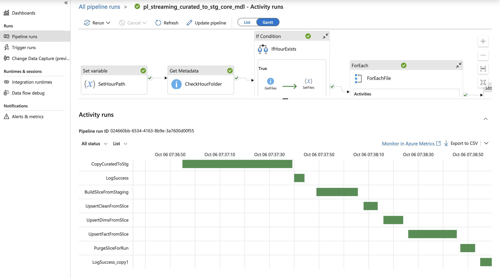
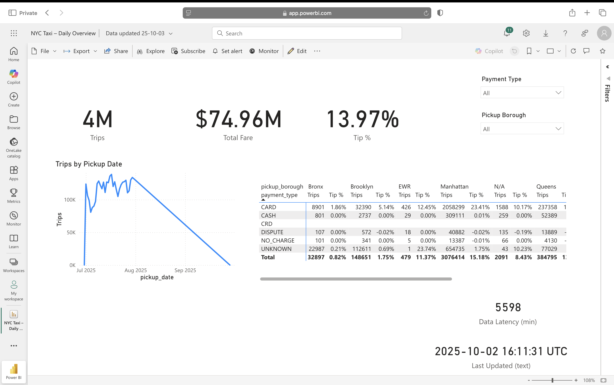

# README_STREAMING.md — Streaming → Curated → Synapse (Hourly + Backfill)

## TL;DR
Event Hubs → Stream Analytics (ASA) parses & applies DQ → ADLS Gen2 stores **raw/curated/DLQ** hourly → ADF loads **staging → slice → dims → fact** in Synapse (hourly + backfill) → Power BI shows **Last Updated / Latency**. Batch and streaming share the **same model tables**.

---

## Architecture (high-level)




```
Producer (Python/app)
   └─> Azure Event Hubs (Hub: trips)
        └─> Stream Analytics Job (ASA)
             ├─ parse + enrich + DQ flags
             ├─ Raw JSONL  ──> ADLS: streaming/…/date=YYYY/MM/DD/time=HH/...
             ├─ Curated CSV ─> ADLS: streaming-curated/…/date=…/time=…/...
             └─ DLQ JSON    ─> ADLS: streaming-dlq/…/date=…/time=…/...
                                        
ADLS (curated hourly) 
   └─> ADF hour pipeline (pl_streaming_curated_to_stg_core_mdl)
        ├─ Copy curated → stg.TripsStreaming (by position)
        ├─ Build slice → core.trip_clean_slice (dedupe/run lineage)
        ├─ Upsert dims (vendor/payment/location)
        ├─ Upsert fact → mdl.fact_trip (update-then-insert, idempotent)
        ├─ Purge slice rows by _runId (run-scoped purge)
        └─ Log success/failure

Backfill wrapper (pl_streaming_backfill + pl_streaming_backfill_range)
   ├─ lastHour    ──> call hour pipeline for last completed hour
   ├─ fixedHour   ──> call hour pipeline for a given hour
   └─ range       ──> loop start..end hour and call hour pipeline each iteration

Synapse (model) → Power BI (view: mdl.vw_fact_trip_bi)
```

**Key ideas**
- Stream to lake **continuously**; land in warehouse via **micro-batch (hourly)** for reliability & cost.
- Synapse-safe **upsert** (update-then-insert; avoid `@@ROWCOUNT`/`MERGE OUTPUT`).
- **Run-scoped purge**: delete `core.trip_clean_slice` rows for this run after model load.
- **Shared model**: batch + streaming both feed `mdl.fact_trip` and dims → BI unchanged.

---

## Components & responsibilities

### Azure Event Hubs
- Ingests JSON events. Default partitioning is fine for the demo.
- Auth with MSI or SAS. (MSI preferred long term.)

### Azure Stream Analytics (ASA) Job
- **Input**: Event Hub (JSON/UTF-8), consumer group dedicated for ASA.
- **Transform** (conceptual):

  - Parse JSON, cast timestamps & numerics.
  - Compute `durationMin`.
  - DQ flags:
    - `missingRequired`: pickup/dropoff/vendor/payment missing.
    - `negativeValues`: fare/distance/total negative.
    - `badDuration`: duration < 0 or > N (e.g., 8 hours).

- **Outputs**:
  - **Raw JSONL** → `streaming/…/date=YYYY/MM/DD/time=HH/` (full fidelity).
  - **Curated CSV** → `streaming-curated/...` (only rows that pass all DQ checks).
  - **DLQ JSON** → `streaming-dlq/...` (rows that fail **any** check + `reason`).
  

> Hourly folders come from ASA output path pattern; files flush throughout the hour.

### ADLS Gen2 (Data Lake)
- Three containers commonly used:
  - `streaming` (raw JSONL) — audit.
  - `streaming-curated` (CSV) — ADF ingestion target.
  - `streaming-dlq` (JSON) — investigation.
- **Lifecycle**: curated → Cool @7d; delete @30–60d; DLQ keep longer; staging cleanup @7d.

### ADF Pipelines

#### Hour pipeline: `pl_streaming_curated_to_stg_core_mdl`
**Purpose**: Load **one hour** of curated files end-to-end.

**Parameters**
- `fixedHourUtc` (string, ISO-8601, e.g., `2025-10-02T14:00:00Z`).

**Variables**
- `hourPath` (string) = format `yyyy/MM/dd/HH` from `fixedHourUtc` (or last hour if null).

**Flow (conceptual)**
1. **SetHourPath**: build `hourPath` from `fixedHourUtc` (fallback: last completed hour).
2. **GetMetadata (folder)**: check curated hour folder exists.
3. **GetFiles**: enumerate childItems.
4. **ForEach (files only)**:
   - **CopyCuratedToStg**: by-position mapping into `stg.TripsStreaming`.
   - **Per-file log**: call `stg.usp_log_ingest` with runId/blobPath/rowsCopied/status/message.
5. **Build slice**: `core.usp_build_trip_clean_slice_streaming @runId` (dedupe, lineage).
6. **Upsert dims**: `mdl.usp_upsert_dims_from_slice_streaming @runId` (vendor/payment/location).
7. **Upsert fact**: `mdl.usp_upsert_fact_trip_streaming @runId, @inserted OUT, @updated OUT, @total OUT`.
8. **Purge slice for run**: `core.usp_purge_trip_clean_slice_streaming @runId`.
9. **Model log**: success/failure audit (either from SP or pipeline).

**Synapse-safe patterns used**
- Upsert: stage → **UPDATE** matched diffs → **INSERT** new → compute counts via temp tables; final `SELECT Inserted/Updated/Total` as a 1-row result set (easy to read from ADF Script) or log inside the SP.
- No reliance on `@@ROWCOUNT` or `MERGE OUTPUT`.

#### Backfill wrapper: `pl_streaming_backfill` + `pl_streaming_backfill_range`
**Modes**
- `lastHour`: compute last full hour and call the hour pipeline once.
- `fixedHour`: call hour pipeline for a given hour.
- `range`: call child `pl_streaming_backfill_range` which loops:
  - Initialize `currentHour = startHourUtc`.
  - **Until** `currentHour > endHourUtc`:
    - Execute hour pipeline with `fixedHourUtc = currentHour`.
    - Compute `nextHour = currentHour + 1h`; then set `currentHour = nextHour` (avoid self-reference rule with two variables).

> Nested loops inside If are avoided by placing **Until** in a child pipeline.

### Synapse (SQL pool)

**Tables (streaming path)**
- `stg.TripsStreaming` — staging table mapped by-position from curated CSV. Includes `tip_amount`, `tolls_amount`, `total_amount`, locations, vendor/payment, lineage columns.
- `core.trip_clean_slice` — run-scoped working set. Adds dedupe id, normalized types, lineage (`_runId, _blobPath, _ingestedAt`). 
- `mdl.dim_vendor`, `mdl.dim_payment_type`, `mdl.dim_location` — dimensions (REPLICATE recommended).
- `mdl.fact_trip` — central fact, **CHAR(64) `trip_id`** (SHA‑256 over vendor/pickup/dropoff/fare/distance/payment); **DISTRIBUTION = HASH(trip_id)**; **CLUSTERED COLUMNSTORE**; optional `last_upsert_run_id`, `last_upsert_at`.

**Stored Procedures**
- `core.usp_build_trip_clean_slice_streaming @runId` — rebuilds the slice from staging for this run/hour.
- `mdl.usp_upsert_dims_from_slice_streaming @runId` — inserts unseen NKs into dims (vendor/payment/location).
- `mdl.usp_upsert_fact_trip_streaming @runId, @inserted OUT, @updated OUT, @total OUT` — resolves keys, computes date/time keys, upserts fact using update-then-insert, returns counts; optionally logs success/failure inside a TRY/CATCH.
- `core.usp_purge_trip_clean_slice_streaming @runId, @deleted OUT` — deletes only this run’s slice rows (run-scoped purge).

**Distributions & indexing**
- Fact: `HASH(trip_id)` + CCI (joins to small replicated dims avoid shuffles). 
- Dims: `REPLICATE` unless very large.
- Optional stats maintenance after load: `UPDATE STATISTICS` on fact + dims.

### Power BI
- Connects to Synapse view `mdl.vw_fact_trip_bi` (flattened). 
- Measures (examples):
  - `Trips = DISTINCTCOUNT([trip_id])`
  - `Total Fare = SUM([fare_amount])`
  - `Tip % = DIVIDE(SUM([tip_amount]), SUM([fare_amount]), 0)`
  - Freshness:
    - `Last Updated (UTC) = MAX([last_upsert_at])` (fallback to `loaded_at` if needed)
    - `Data Latency (min) = DATEDIFF([Last Updated (UTC)], NOW(), MINUTE)`

---

## Parameters & expressions (reference)

### Hour pipeline
- `fixedHourUtc` (ISO-8601 string): if null, compute last completed hour.
- `hourPath` (variable): format to `yyyy/MM/dd/HH` from `fixedHourUtc`.

### Backfill range pipeline
- `startHourUtc`, `endHourUtc` (ISO-8601, hour-aligned).
- Loop condition: **Until** `currentHour > endHourUtc`.
- Increment pattern: compute `nextHour = addHours(currentHour, 1)` then set `currentHour = nextHour` (use two Set Variable activities to avoid self-reference errors).

> Common pitfalls solved:
> - Always use dynamic expressions (start with `@`); don’t quote params/vars.
> - Pass **real** ISO timestamps (`…THH:00:00Z`), never labels like `lastHour`.

---

## Logging & monitoring

- **Ingest audit**: `stg.TripsStreaming_Ingest_Audit` with per-file and per-model run logs (`runId, blobPath, rowsCopied, status, message, createdAt`). SP: `stg.usp_log_ingest`.
- **Model counts**: Upsert SP returns `Inserted/Updated/Total` (via result set or output params); optionally logs inside the SP.
- **Platform alerts** (Azure Monitor):
  - ADF: Pipeline failed runs; Activity failed runs.
  - ASA: Watermark delay; Backlogged input events; Job status degrade/stop.
  - Event Hubs: Throttled requests; Server errors.
  - Storage: Availability / 5xx (optional).
  - Synapse: CPU %, tempdb %, queued queries.

---

## Operations

### Triggers
- **Hourly** on hour pipeline (process last completed hour). 
- Disable during large backfills or add dedupe guards (e.g., consult audit to skip already-processed hours).

### Backfill
- Run wrapper in `range` mode with `startHourUtc`, `endHourUtc`. 
- Each iteration is a full hour run (idempotent), followed by run-scoped purge.

### Reruns
- Safe to rerun the same `fixedHourUtc`: upsert is idempotent; slice is purged after each success.

### Storage lifecycle
- Curated → Cool @7d, Delete @30–60d; DLQ keep longer; ADF staging cleanup @7d.
- Soft delete enabled for safety.

---

## Quality & lineage roadmap (optional)

### Row-level data quality counters (M)
- Add counters per run into an **audit table** (or extend existing): 
  - `good_rows`, `dlq_rows`, `null_vendor`, `null_payment`, `negative_fare`, `bad_duration`, etc.
- Count from `core.trip_clean_slice` (for good rows) and from DLQ summary (optional ADF step). 
- Log via `stg.usp_log_ingest` (message JSON) or a dedicated `*_Quality_Audit` table.

### Purview lineage (L)
- Register resources (Event Hubs, ASA, ADLS, ADF, Synapse) in Purview.
- Scan sources; enable lineage collection for ADF & ASA.
- Expected graph: **EH → ASA → ADLS (curated) → ADF → Synapse (stg/core/mdl)**.

---

## Verification checklist

- **After a run**:
  - `SELECT COUNT(*) FROM core.trip_clean_slice WHERE _runId = '<RunId>';` → **0** (purged).
  - Upsert counts present (either in pipeline output result set or `stg.TripsStreaming_Ingest_Audit`).
  - `SELECT TOP 5 trip_id, last_upsert_at FROM mdl.fact_trip ORDER BY last_upsert_at DESC;` → changed recently.
- **Power BI**:
  - Refresh → **Last Updated** changed; **Latency (min)** reasonable.
- **Backfill (range)**:
  - Monitor shows one child run per hour; each child purged its slice rows.

---

## Troubleshooting (quick)

- **InvalidTemplate: `rowsAffected` / `outputParameters` missing**  
  Use a **Script** activity that `SELECT`s one-row result set (`Inserted/Updated/Total`) or log inside the SP.
- **formatDateTime with `'lastHour'`**  
  You passed a label, not a timestamp. Pass ISO (`…THH:00:00Z`) or let the child compute last hour.
- **Self-referencing variable in Set Variable**  
  Use a temp var (`nextHour`): compute nextHour from currentHour, then assign currentHour = nextHour.
- **No inserts**  
  Likely all rows **matched** (only updates). Verify with a dry-run query comparing slice vs fact; ensure keys and precisions match the batch recipe.

---

## Screenshots


**Stream Analytics (ASA)**



**ADLS curated hour**


**ADF hour pipeline run**


**Synapse verification**


**Power BI freshness**



---

## Related docs
- **High-level README**: [README.md](./README.md)
- **Batch ELT**: [README_BATCHELT.md](./README_BATCHELT.md)

---

## License
MIT (or your preferred license).
